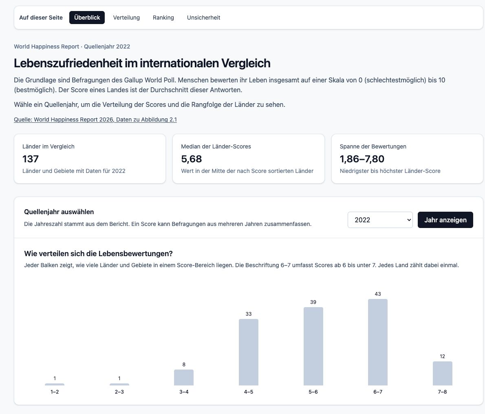
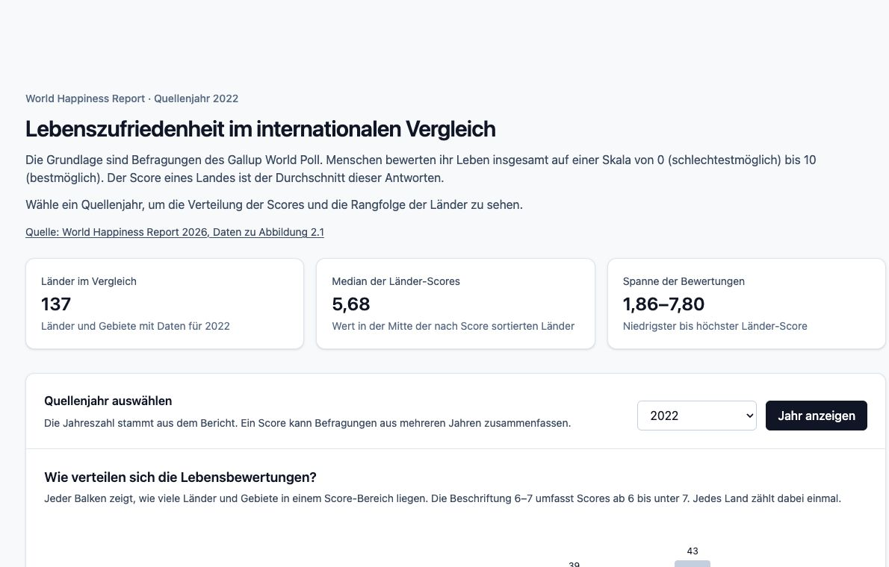
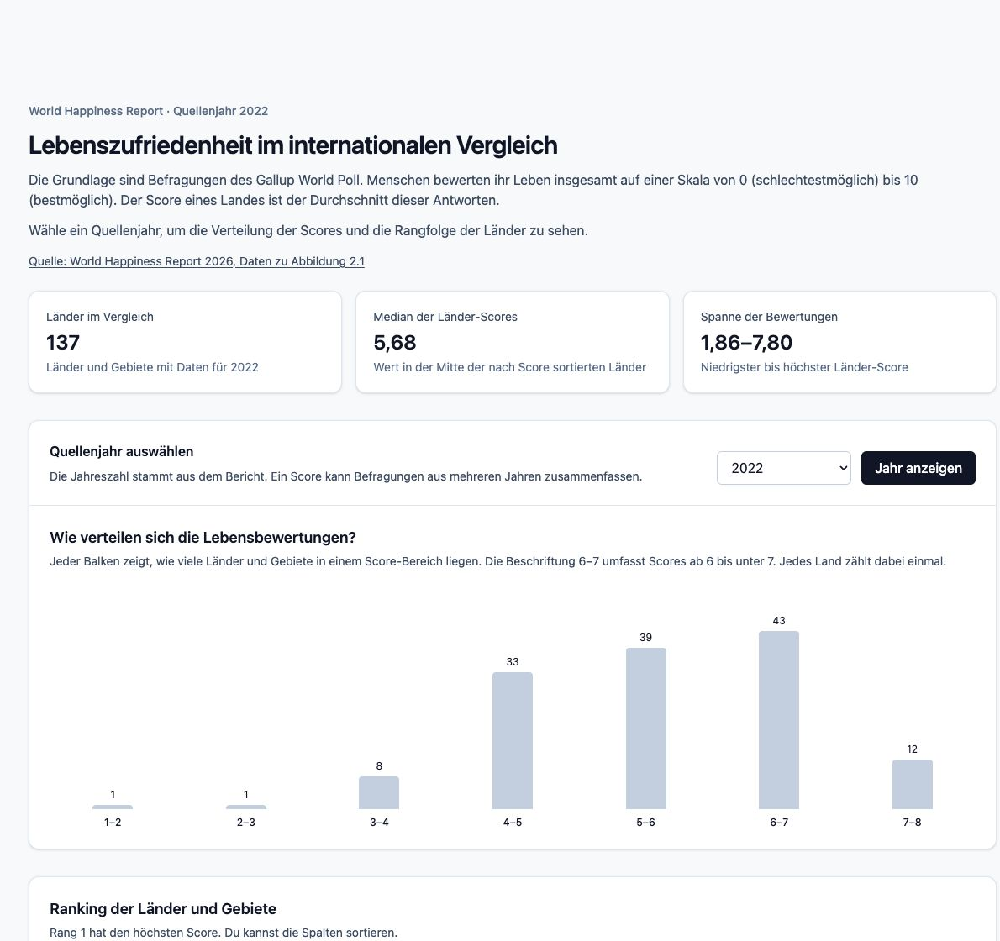

# Happiness Atlas

Ein Dashboard zur Lebensbewertung von Ländern und Gebieten. Es zeigt die veröffentlichten Scores aus dem [World Happiness Report 2026, Daten zu Abbildung 2.1](https://www.worldhappiness.report/data-sharing/). Grundlage sind Befragungen des Gallup World Poll: Menschen bewerten ihr eigenes Leben auf einer Skala von 0 bis 10. Der Länder-Score ist der Durchschnitt dieser Antworten.

Die [Aufgabenstellung](docs/AUFGABENSTELLUNG.txt) und das [Projektprotokoll](docs/PROTOKOLL.md) liegen im Ordner `docs/`.



*Dashboard mit Quellenjahr 2022. Die angezeigten Zahlen stammen aus den importierten Quelldaten.*

## Was das Dashboard zeigt

- **Überblick:** Anzahl der Länder und Gebiete, Median der Länder-Scores und Spanne vom niedrigsten bis zum höchsten Score.
- **Jahresauswahl und Verteilung:** Die Auswahl enthält nur Quellenjahre mit Daten. Die Balken zählen Länder innerhalb von Score-Bereichen, etwa 6 bis unter 7.
- **Ranking:** Länder, Rang, Score und – sofern vorhanden – das 95-%-Konfidenzintervall. Die Tabelle lässt sich sortieren und seitenweise durchblättern.
- **Unsicherheit:** Für ein gewähltes Land zeigt die Seite den Score mit seinen Intervallgrenzen und listet Länder auf, deren Intervalle sich direkt mit diesem Bereich überschneiden. Eine Überlappung beweist weder gleiche Landesdurchschnitte noch eine andere Rangfolge.



*Ranking für 2022 mit den veröffentlichten Scores und Intervallgrenzen.*



*Beispiel für einen Landes-Score mit 95-%-Intervall und direkt überlappenden Bereichen.*

## Lokal starten

Voraussetzung ist Docker mit Docker Compose:

```sh
git clone https://github.com/andreashohlweg-student/ProjektHappyIndexSonja_Leona_Florian_Andreas.git
cd ProjektHappyIndexSonja_Leona_Florian_Andreas
docker compose up --build
```

Wer das Repository bereits lokal hat, führt nur den letzten Befehl im Projektordner aus.

| Dienst | Adresse auf dem eigenen Rechner |
| --- | --- |
| Dashboard | <http://localhost:5173> |
| Backend-API | <http://localhost:3000> |
| PostgreSQL | `localhost:5432` |

Die Standardports und das lokale Datenbankpasswort stehen in [.env.example](.env.example). Wenn ein Port bereits belegt ist, die Datei als `.env` kopieren und `WEB_PORT`, `API_PORT` oder `DB_PORT` anpassen. Das Frontend leitet Aufrufe unter `/api` an das Backend weiter; direkt am Backend heißen die Routen `/years` und `/rankings`.

Änderungen unter `frontend/src` und `backend/src` werden in die Entwicklungscontainer eingebunden. Bei Änderungen an Paketen oder Dockerfiles die Images mit `docker compose up --build` neu bauen.

Zum Beenden:

```sh
docker compose down
```

Das Datenbank-Volume bleibt dabei erhalten. `docker compose down -v` **löscht** das lokale Volume und damit die importierten Daten; beim nächsten Start werden die SQL-Dateien unter `backend/src/db/init/` erneut ausgeführt.

## API

| Anfrage | Ergebnis |
| --- | --- |
| `GET /years` | Verfügbare Quellenjahre als absteigend sortierte Zahlenliste. |
| `GET /rankings?year=2022` | Ranking des angegebenen Jahres, aufsteigend nach Rang. Ein Jahr ohne Daten liefert `[]`. |

Zum Ausprobieren:

```sh
curl http://localhost:3000/years
curl 'http://localhost:3000/rankings?year=2022'
```

Ein Ranking-Eintrag enthält `source_rank`, `country_name`, `source_year`, `score`, `ci_lower` und `ci_upper`. Die Intervallgrenzen können `null` sein, wenn sie für ein Quellenjahr nicht vorliegen.

Fehlerantworten haben die Form `{"error":"..."}`: HTTP 400 bei einem ungültigen Jahresparameter, 404 bei einer unbekannten Route, 503 bei nicht erreichbarer Datenbank und 500 bei einem unerwarteten Serverfehler. Das Frontend zeigt Lade- und Fehlermeldungen und bietet einen erneuten Versuch an.

## Datenbank mit pgAdmin ansehen

In pgAdmin einen Server mit diesen lokalen Verbindungsdaten registrieren:

| Feld | Wert |
| --- | --- |
| Host | `127.0.0.1` |
| Port | `5432` oder der Wert von `DB_PORT` in `.env` |
| Datenbank | `happiness` |
| Benutzer | `happiness` |
| Passwort | `happiness_local` oder der Wert von `POSTGRES_PASSWORD` in `.env` |

Die Datenbank ist in `compose.yaml` nur an die lokale Rechneradresse gebunden. pgAdmin kann deshalb auf demselben Rechner außerhalb des Containers laufen.

## Daten richtig lesen

`source_year` ist das Jahreslabel der Quelldatei. Ein Score kann Befragungen aus mehreren Jahren zusammenfassen; der Eintrag für 2025 beruht beispielsweise auf Daten von 2023 bis 2025. Für 2013 enthält der importierte Datensatz keine Werte.

| Feld | Bedeutung |
| --- | --- |
| `score` | Durchschnittliche Lebensbewertung der Befragten auf der Skala von 0 bis 10. |
| `source_rank` | Platzierung innerhalb des Quellenjahres; Rang 1 hat den höchsten Score. |
| `ci_lower`, `ci_upper` | Untere und obere Grenze des 95-%-Konfidenzintervalls für den geschätzten Landesdurchschnitt. |

Das Intervall beschreibt die **Schätzunsicherheit des Durchschnitts**, nicht die Streuung einzelner Antworten. Seine Breite zeigt, wie präzise der Score geschätzt wurde. Der Score wird nicht aus den ebenfalls importierten Modellbeiträgen für Einkommen, Gesundheit oder andere Faktoren addiert. Der [World Happiness Report erklärt die Messung und die Intervalle](https://www.worldhappiness.report/faq/).

In der Datenbank enthält `countries` die einheitlichen Anzeigenamen. `observations` enthält je Land und Quellenjahr einen Eintrag mit Rang, Score und weiteren Quellspalten. Die SQL-Dateien im Ordner `backend/src/db/init/` legen die Tabellen an und befüllen sie nur, wenn das Docker-Volume noch leer ist.

## Projektaufbau

| Pfad | Inhalt |
| --- | --- |
| `frontend/src/` | React-Dashboard mit Tailwind CSS und AG Grid für das Ranking. |
| `backend/src/rankings/`, `backend/src/years/` | Express-Routen, Controller und Datenbankabfragen. |
| `backend/src/db/init/` | PostgreSQL-Schema und Quelldatenimport. |
| `compose.yaml` | Frontend, Backend und PostgreSQL für die lokale Entwicklung. |
| `docs/` | Aufgabenstellung, Projektprotokoll und Screenshots. |

Bei Startproblemen helfen `docker compose ps` und `docker compose logs -f backend database`. Wenn die API HTTP 503 meldet, ist die Datenbankverbindung nicht verfügbar; nach dem Start der Datenbank kann die Anfrage im Dashboard erneut ausgelöst werden.
