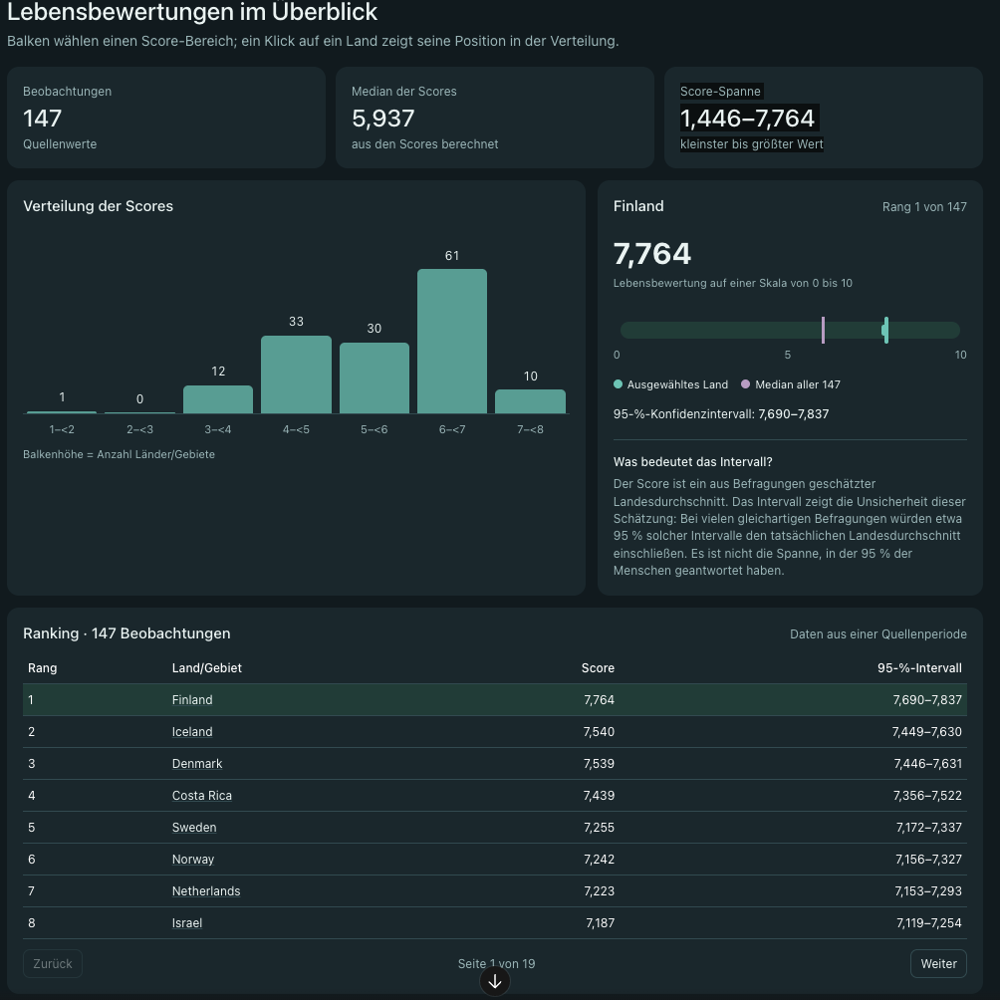

# Projektprotokoll Happiness Atlas

Team: Andreas, Leona, Sonja, Florian · Projektwoche Modul 4, 28.09.–02.10.2026
Stand: Mittwoch, 30.09.2026, 

---

## Ziel

Ein Dashboard für die Redaktion *Health & Society News*. Leserinnen und Leser sollen sehen, wie zufrieden die Menschen in den Ländern der Welt mit ihrem Leben sind (World Happiness Report 2026, 147 Länder im Jahr 2025).

Vorlage/Dashboard-Entwurf:

Bausteine: Kennzahlen oben (Anzahl, Median, Spanne), Verteilung der Scores als Säulendiagramm, Detailansicht eines Landes mit Konfidenzintervall, Ranking-Tabelle mit Seiten.

---

## Tag 1 – Montag, 28.09.

- Kickoff, Team gefunden, Projekt „World Happiness Index“ gewählt
- Repo aufgesetzt, erster Starter und Roadmap erstellen lassen

## Tag 2 – Dienstag, 29.09.

- Den KI-Starter auf ein Grundgerüst wie in der Vorlesung zurückgebaut: `frontend/` (React + Vite), `backend/` (Express + pg), PostgreSQL mit zwei Tabellen (`countries`, `observations`), Start über `docker compose up`
- **Erster Durchstich:** `GET /rankings?year=…` von der Datenbank bis zur Tabelle im Browser
  - SQL mit JOIN (Ländername aus `countries`) und Platzhalter `$1` für das Jahr
  - Router → Controller → Repository im Feature-Ordner `backend/src/rankings/`
  - zentrale Fehlerbehandlung (404 / 500) in `backend/src/middleware/`
- Ranking-Tabelle mit AG Grid, Jahr über ein Eingabefeld wählbar
- Dashboard-Entwurf per KI erstellt, Grundlage für Tag 3 und 4

## Tag 3 – Mittwoch, 30.09.

Ziel: alle Dashboard-Bausteine **funktional** abbilden, noch ohne Styling.

- Check-in: Stand vorgestellt, Dashboard-Entwurf gezeigt
- `RankingTable` als eigene Komponente, mit Spalte „95-%-Intervall“ (Backend liefert jetzt `ci_lower`, `ci_upper`)
- Pagination mit eigenen Zurück/Weiter-Buttons (8 Zeilen pro Seite)
- `Card` als wiederverwendbare Kachel, `Header` mit den drei Kennzahlen (Anzahl, Median, Spanne)
- „Verteilung der Scores“: `Distribution` zählt die Länder pro Score-Bereich (1–<2, 2–<3, …), `DistributionColumn` zeichnet je Bereich eine Säule. Die Säule ist ein `<button>`, damit sie später anklickbar ist. Die Höhe wird in der Eltern-Komponente berechnet: `Anzahl / höchste Anzahl × 160 px`.

---

## Ausblick

### Tag 4 – Donnerstag, 01.10.

1. **Aussehen** des Dashboards nach dem Entwurf (Styling)
2. **Klick auf eine Säule** filtert die Ranking-Tabelle auf diesen Score-Bereich.
   Heute bekommt die Tabelle ihre Daten direkt aus dem `fetch`. Dafür braucht `App` einen zusätzlichen State (z. B. `selectedRange`). `Distribution` setzt ihn per Klick, und `RankingTable` bekommt nur die passenden Länder.
3. **Klick auf ein Land** in der Tabelle öffnet die Detailansicht (neue Komponente, ebenfalls über einen State in `App`, z. B. `selectedCountry`)
4. **Jahr per Combo-Box** statt Zahlenfeld, die Auswahl kommt aus dem Backend: **zweiter Endpunkt**, z. B. `GET /years`, liefert alle vorhandenen Jahre (2013 fehlt in den Daten)

### Tag 5 – Freitag, 02.10.

- voraussichtlich Projektvorstellung
- vorher: Puffer, README aktualisieren, Demo durchspielen

